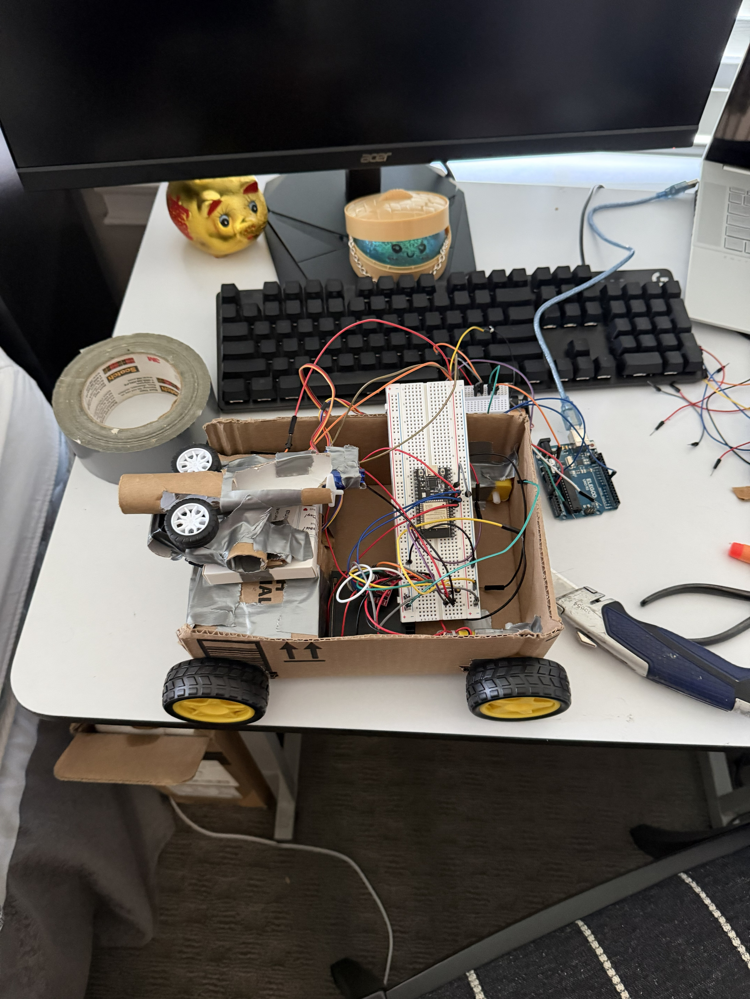
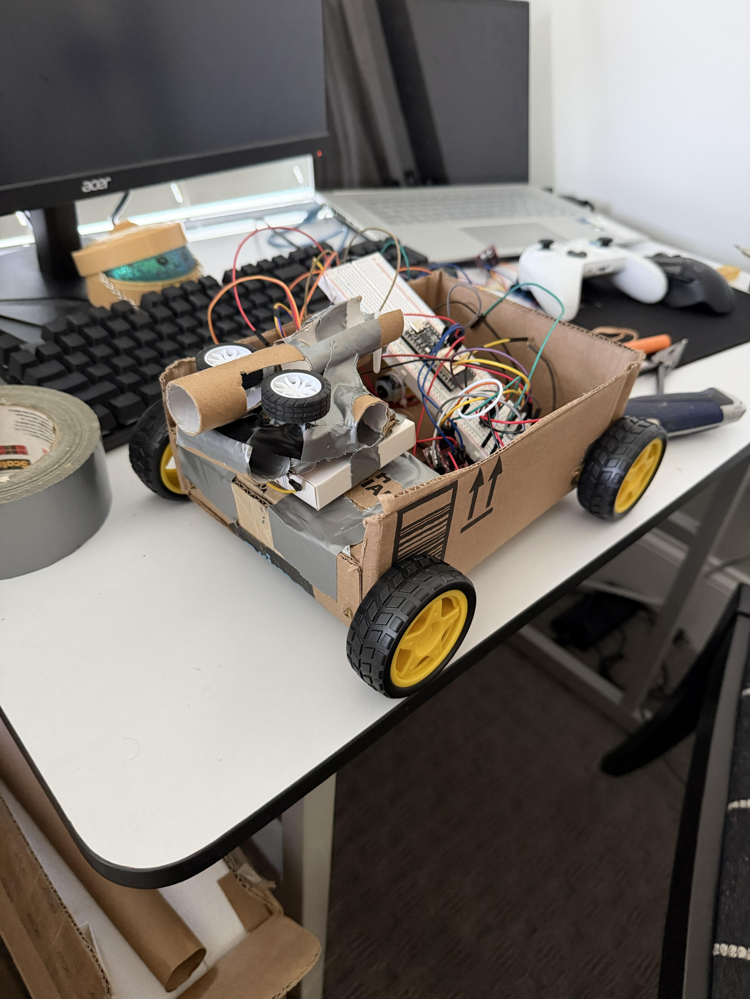
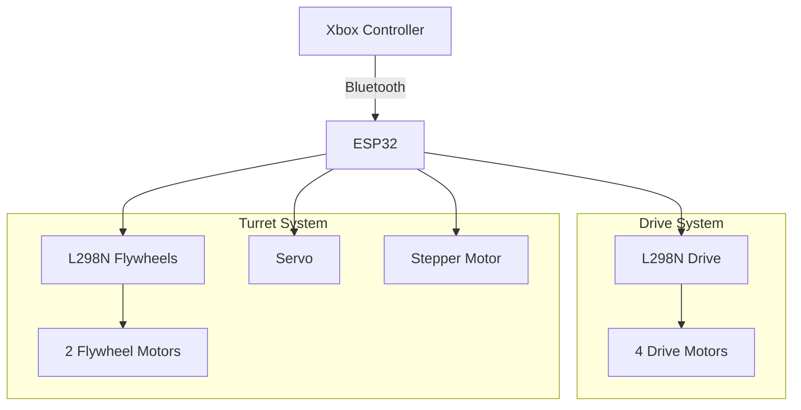

# Mini Tank RC Car Project Overview
<p align="center">
  
  
  
  

</p

Designed and built a custom Bluetooth-controlled RC vehicle using an ESP32 microcontroller as a personal engineering project. The project integrates mechanical design, electrical systems, embedded programming, and motor control to create a modular platform that can be expanded with additional actuators and mechanisms. Development focused on designing reliable hardware, programming responsive controls, troubleshooting electrical systems, and iteratively improving performance through testing.

Key Features & Responsibilities
Designed and assembled the electrical and mechanical systems for a four-wheel drive RC vehicle using DC gear motors and an L298N motor driver.
Programmed an ESP32 in C++ using the Arduino IDE to communicate wirelessly with an Xbox controller through Bluetooth.
Developed custom control software to provide proportional steering, acceleration, braking, and motor control with joystick dead-zone compensation.
Integrated additional motion systems including a servo motor and stepper motor for auxiliary functions controlled independently from vehicle movement.
Designed a modular architecture that allows future expansion with flywheel motors, additional sensors, and custom 3D-printed components.
Selected and integrated electronic components including motor drivers, voltage regulation, power distribution, and battery systems while considering current draw, voltage requirements, and electrical safety.
Debugged hardware and software issues involving motor synchronization, controller connectivity, wiring, power delivery, and embedded code.
Applied engineering principles related to embedded systems, electromechanical design, circuit design, power management, and rapid prototyping throughout development.

# Electronic Components

## Microcontroller
- **ESP32 Development Board**
  - Acts as the central controller for the entire system.
  - Receives Bluetooth input from an Xbox controller.
  - Processes user inputs and controls all motors and actuators.


## Drive System
### DC Drive Motors
- **4x DC Gear Motors**
  - Configured as a four-wheel drive platform.
  - Left-side motors are wired together.
  - Right-side motors are wired together.

### Motor Driver
- **1x L298N Motor Driver**
  - Controls the left and right drive motors.
  - Receives direction commands from the ESP32.
  - Powered by a dedicated 6V battery pack.

## Turret / Launcher System

### Flywheel Motors
- **2x DC Flywheel Motors**
  - Provide the launching force for Nerf darts.
  - Operate simultaneously when the launcher is activated.

### Motor Driver
- **1x L298N Motor Driver**
  - Controls both flywheel motors.
  - Receives activation commands from the ESP32.
  - Powered by the same 6V battery pack.

### Loading Mechanism
- **1x Servo Motor**
  - Pushes darts into the spinning flywheels.
  - Controlled directly by the ESP32.

### Turret Rotation
- **1x Stepper Motor**
  - Provides 360° horizontal rotation of the launcher.
  - Controlled by the ESP32 for precise positioning.

# Power System

### ESP32 Power
- **Portable USB Power Bank (5V)**
  - Powers only the ESP32 through its USB connection.
  - Provides stable regulated 5V power for the controller.

### Motor Power
- **4x AA Battery Pack (6V)**
  - Powers both L298N motor drivers.
  - Supplies power to:
    - Drive motors
    - Flywheel motors
    - Servo
    - Stepper motor


# System Overview

# System Code
```cpp
#include <Bluepad32.h>
#include <ESP32Servo.h>
#include <AccelStepper.h>

ControllerPtr myController = nullptr;

// Car motor pins
const int IN1 = 25;
const int IN2 = 26;
const int IN3 = 27;
const int IN4 = 14;

// Servo pin
const int SERVO_PIN = 13;

// Flywheel motor pins
const int FLY1_IN1 = 16;
const int FLY1_IN2 = 17;
const int FLY2_IN1 = 21;
const int FLY2_IN2 = 22;

// Stepper pins
const int STP1 = 32;
const int STP2 = 33;
const int STP3 = 18;
const int STP4 = 19;

// For 28BYJ-48 + ULN2003 driver
AccelStepper stepper(
  AccelStepper::HALF4WIRE,
  STP1,
  STP3,
  STP2,
  STP4
);

Servo myServo;

const int DEADZONE = 80;

// Trigger must be above this value to activate
const int TRIGGER_THRESHOLD = 20;

void onConnectedController(ControllerPtr ctl) {
  myController = ctl;
  Serial.println("Controller connected!");
}

void onDisconnectedController(ControllerPtr ctl) {
  myController = nullptr;

  stopCar();
  stopFlywheels();

  myServo.write(90);
  stepper.setSpeed(0);

  Serial.println("Controller disconnected!");
}

void setup() {
  Serial.begin(115200);

  // Car motor pins
  pinMode(IN1, OUTPUT);
  pinMode(IN2, OUTPUT);
  pinMode(IN3, OUTPUT);
  pinMode(IN4, OUTPUT);

  // Flywheel motor pins
  pinMode(FLY1_IN1, OUTPUT);
  pinMode(FLY1_IN2, OUTPUT);
  pinMode(FLY2_IN1, OUTPUT);
  pinMode(FLY2_IN2, OUTPUT);

  // Servo setup
  myServo.attach(SERVO_PIN);
  myServo.write(90);

  // Stepper setup
  stepper.setMaxSpeed(800);
  stepper.setAcceleration(400);

  stopCar();
  stopFlywheels();

  BP32.setup(
    &onConnectedController,
    &onDisconnectedController
  );

  Serial.println("Ready. Connect Xbox controller.");
}

void loop() {
  BP32.update();

  if (myController && myController->isConnected()) {

    // --------------------------------
    // Left stick controls the car
    // --------------------------------

    int x = myController->axisX();
    int y = myController->axisY();

    if (abs(x) < DEADZONE) {
      x = 0;
    }

    if (abs(y) < DEADZONE) {
      y = 0;
    }

    int forward = -y;
    int turn = x;

    int leftSpeed =
      constrain(forward + turn, -512, 512);

    int rightSpeed =
      constrain(forward - turn, -512, 512);

    leftSpeed =
      map(leftSpeed, -512, 512, -255, 255);

    rightSpeed =
      map(rightSpeed, -512, 512, -255, 255);

    driveMotors(leftSpeed, rightSpeed);

    // --------------------------------
    // RT controls the servo
    // --------------------------------

    int rightTrigger = myController->throttle();

    if (rightTrigger > TRIGGER_THRESHOLD) {
      myServo.write(135);
    } else {
      myServo.write(90);
    }

    // --------------------------------
    // LT controls both flywheel motors
    // --------------------------------

    int leftTrigger = myController->brake();

    if (leftTrigger > TRIGGER_THRESHOLD) {
      runFlywheels();
    } else {
      stopFlywheels();
    }

    // --------------------------------
    // Right stick X controls stepper
    // --------------------------------

    int rx = myController->axisRX();

    if (abs(rx) < DEADZONE) {
      rx = 0;
    }

    int stepperSpeed =
      map(rx, -512, 512, -600, 600);

    stepper.setSpeed(stepperSpeed);

  } else {
    stopCar();
    stopFlywheels();

    myServo.write(90);
    stepper.setSpeed(0);
  }

  stepper.runSpeed();
}

void driveMotors(int leftSpeed, int rightSpeed) {
  setMotor(IN1, IN2, leftSpeed);
  setMotor(IN3, IN4, rightSpeed);
}

void setMotor(int pin1, int pin2, int speedVal) {
  if (abs(speedVal) < 20) {
    digitalWrite(pin1, LOW);
    digitalWrite(pin2, LOW);
    return;
  }

  if (speedVal > 0) {
    digitalWrite(pin1, HIGH);
    digitalWrite(pin2, LOW);
  } else {
    digitalWrite(pin1, LOW);
    digitalWrite(pin2, HIGH);
  }
}

void runFlywheels() {
  // Motor 1 forward
  digitalWrite(FLY1_IN1, HIGH);
  digitalWrite(FLY1_IN2, LOW);

  // Motor 2 forward
  digitalWrite(FLY2_IN1, HIGH);
  digitalWrite(FLY2_IN2, LOW);
}

void stopFlywheels() {
  digitalWrite(FLY1_IN1, LOW);
  digitalWrite(FLY1_IN2, LOW);

  digitalWrite(FLY2_IN1, LOW);
  digitalWrite(FLY2_IN2, LOW);
}

void stopCar() {
  digitalWrite(IN1, LOW);
  digitalWrite(IN2, LOW);
  digitalWrite(IN3, LOW);
  digitalWrite(IN4, LOW);
}
```

# CAD Design

The mechanical components of the vehicle and turret system were modeled in **Autodesk Fusion 360**. CAD modeling was used to plan component placement, verify clearances, design mounting features, and develop custom parts for 3D printing.

These CAD models could be used to make 3D-printed parts for the completed version of this project. The working prototype was designed to replicate these designs.

## Full Assembly

<p align="center">
  
  
</p>

- Modeled the complete vehicle assembly to evaluate component placement and overall packaging.
- Used the assembly to check mechanical clearances and component fit before fabrication.

## Chassis Design

<p align="center">
  

</p>

- Designed a custom chassis to support the four-wheel drive system and electronic components.
- Incorporated mounting locations for motors, electronics, and power components.
- Designed with future modifications and additional components in mind.

## Turret Assembly

<p align="center">
  
</p>

- Designed a rotating turret assembly for the Nerf dart launching system.
- Integrated mounting for the stepper motor, flywheel system, and loading mechanism.
- Designed the assembly to allow for horizontal rotation.

## Flywheel Launcher

<p align="center">
  
</p>

- Modeled the DC flywheels to work with the DC motors.
- Designed the flywheel spacing to guide Nerf darts between the two rotating wheels.
- Incorporated motor mounting features to maintain alignment during operation.

## External Components

<p align="center">
  
  
  
  

</p

-These are the designs of the components. While I did not design them, they are replicas of the electronic components used in this project.

Component Credits:
- DC Flywheel Motor: https://grabcad.com/library/dc-motor-3-6v-generic-brand-2
- Servo Motor: https://grabcad.com/library/servo-motor-micro-sg90-1
- Stepper: https://grabcad.com/library/28byj-48-8
- Wheels and Motors: https://grabcad.com/library/tt-dc-gear-motor-wheel-assembly-1/details?folder_id=14218023


